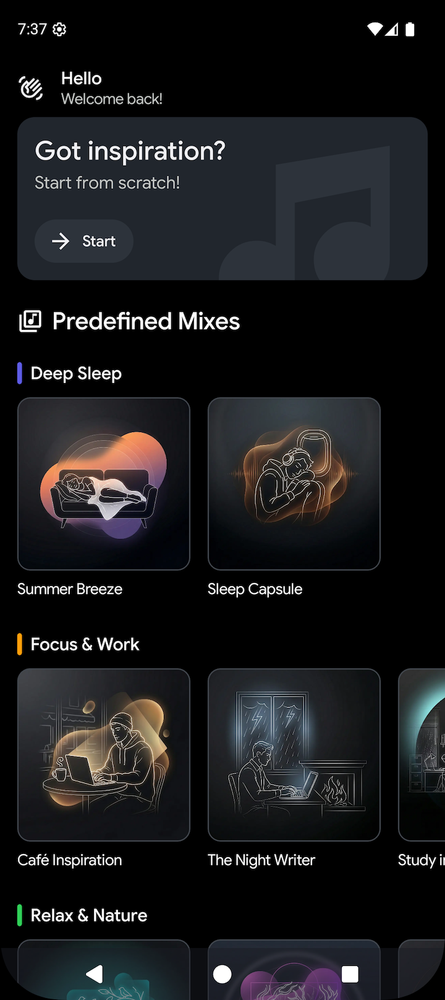

# Atmosia: Relaxing Sounds

A modern, user-friendly, native Android application built in **Kotlin** with **Jetpack Compose**. It allows users to combine over 50 ambient sounds into custom relaxing mixes, offering an immersive user experience designed to reduce stress, beat insomnia, and boost productivity.

### ⚠️ Coming soon to the Google Play Store
*(The app is currently under review for publication)*

## 📱 Features

* **Extensive Sound Library**: Access over 50 high-fidelity ambient sounds neatly categorized into Water, Animals, Transport, and Indoor environments.
* **Custom Audio Mixer**: Combine multiple sounds simultaneously and adjust the volume of each track independently to create your perfect atmosphere.
* **Ready-made Mixes**: Enjoy expertly crafted, predefined atmospheres designed for specific moments: Sleep, Focus, Nature, and Travel.
* **Smart Sleep Timer**: Fall asleep without worries by setting a custom timer to gently stop the audio playback and save battery life.
* **Background Playback**: Keep listening to your relaxing mixes even when the screen is off or while using other apps.
* **Media Notification Controls**: Control your active mixes (pause, resume, or stop) directly from the system's media session notification.
* **TalkBack Support**: Fully optimized for accessibility to ensure a great experience for all users.
* **Multiple Languages Supported**: The application is fully localized and available in English, Spanish, Portuguese, Italian, and French.

## 🛠️ Tech Stack

| Component                 | Technology                             |
|:--------------------------| :------------------------------------- |
| **UI**                    | Jetpack Compose                        |
| **Architecture**          | MVVM & Clean Architecture              |
| **Dependency Injection**  | Koin                                   |
| **Navigation**            | Compose Navigation                     |
| **Local Database**        | Room                                   |
| **Audio**                 | ExoPlayer (Media3)                     |
| **Foreground Service**    | Media Session                          |
| **Analytics**             | Firebase Analytics                     |
| **Crash Reporting**       | Firebase Crashlytics                   |
| **Wave Animation**        | Rive                                   |

## 📸 Screenshots

| **Home** | **Audio Mixer - No Sounds** | **Sounds Selector** |
|:---:|:---:|:---:|
|  |  |  |
| **Chorometer - No Session Started**| **Timer - No timer set** | **Set time** |
|  |  |  |
| **Timer - Session started**| **Manage tracks** | **Notification** |
|  |  |  |
| **Session paused**| |  |
|  |  |  |
