# Atmosia: Relaxing Sounds

A modern, user-friendly, native Android application built in **Kotlin** with **Jetpack Compose**. It allows users to combine over 80 ambient sounds into custom relaxing mixes, offering an immersive user experience designed to reduce stress, beat insomnia, and boost productivity.

## 📱 Features

* **Extensive Sound Library**: Access over 80 high-fidelity ambient sounds neatly categorized into Water, Nature, Animals, Transport, and Indoor environments.
* **Secure User Authentication**: Sign up and log in seamlessly using your Email or Google Account.
* **Account Management**: Includes essential user flows such as Password Reset and the ability to permanently delete your account and data, ensuring full GDPR/Google Play compliance.
* **Custom Audio Mixer**: Combine multiple sounds simultaneously and adjust the volume of each track independently to create your perfect atmosphere.
* **Ready-made Mixes**: Enjoy expertly crafted, predefined atmospheres designed for specific moments: Sleep, Focus, Nature, and Travel.
* **Cloud Sync & Storage**: Your custom sound mixes are automatically saved in Firestore, allowing you to access your personal library from any device, anytime.
* **Smart Sleep Timer**: Fall asleep without worries by setting a custom timer to gently stop the audio playback and save battery life.
* **Background Playback**: Keep listening to your relaxing mixes even when the screen is off or while using other apps.
* **Media Notification Controls**: Control your active mixes (pause, resume, or stop) directly from the system's media session notification.
* **Open app reminder Notification**: Notification that trigger after a period of inactivity to ensure your app stays part of the user's routine.
* **In-app Review**: Support in-app review to increase the change the user leave a review.
* **In-app Update**: Support in-app update to provide a seamless way for users to stay up-to-date.
* **In-app Subscription**: Subscription management integrated via RevenueCat to handle premium tiers.
* **TalkBack Support**: Fully optimized for accessibility to ensure a great experience for all users.
* **Multiple Languages Supported**: The application is fully localized and available in English, Spanish, Portuguese, Italian, and French.

## 🛠️ Tech Stack

| Component                 | Technology                             |
|:--------------------------| :------------------------------------- |
| **UI**                    | Jetpack Compose                        |
| **Architecture**          | MVVM & Clean Architecture              |
| **Dependency Injection**  | Koin                                   |
| **Navigation**            | Compose Navigation                     |
| **Authentication**        | Firebase Auth (Email & Google)         |
| **Local Database**        | Room                                   |
| **Cloud Database**        | Firebase Firestore                     |
| **Audio**                 | ExoPlayer (Media3)                     |
| **Foreground Service**    | Media Session                          |
| **Reminder Notification** |	WorkManager                            |
| **Ads**                   | Google AdMob                           |
| **Subscription**          | RevenueCat                             |
| **Analytics**             | Firebase Analytics                     |
| **Crash Reporting**       | Firebase Crashlytics                   |
| **Wave Animation**        | Rive                                   |

## 📸 Screenshots

| **Explore** | **Login to access** | **Sign in** | **No mixes created** |
|:---:|:---:|:---:|:---:|
| 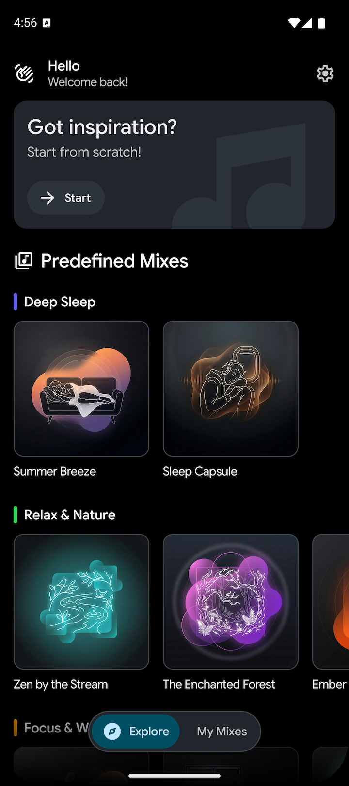 | 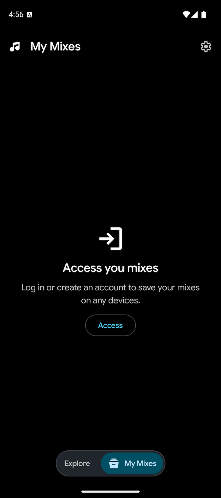 | 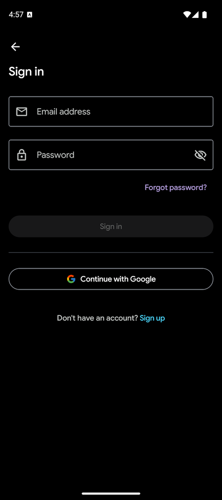 | 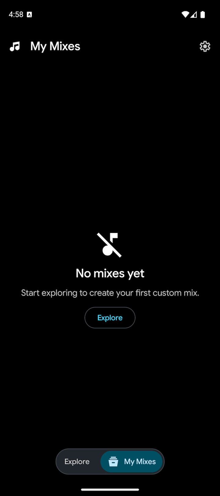 |
| **Audio Mixer - No Sounds** | **Sounds Selector** | **Chorometer - No Session Started** | **Save mix** |
| 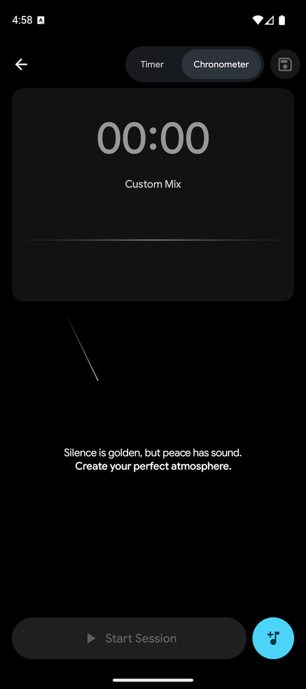 | 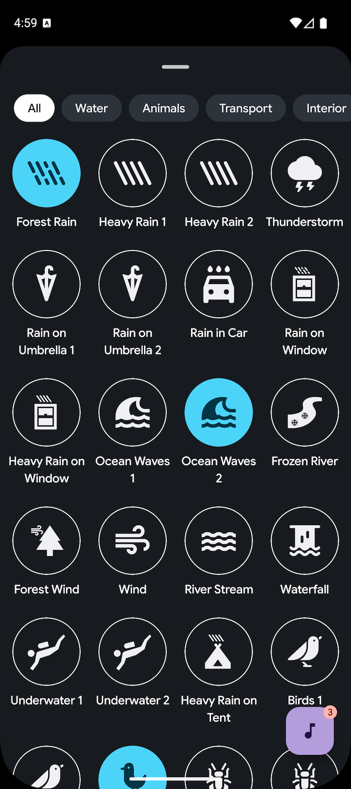 | 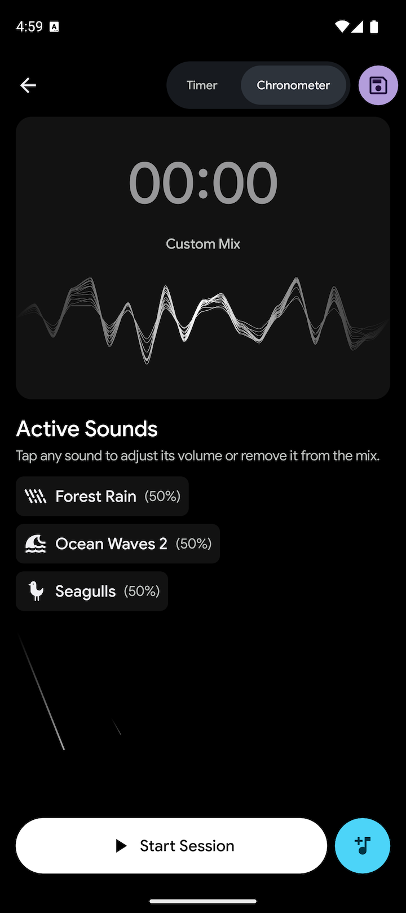 | 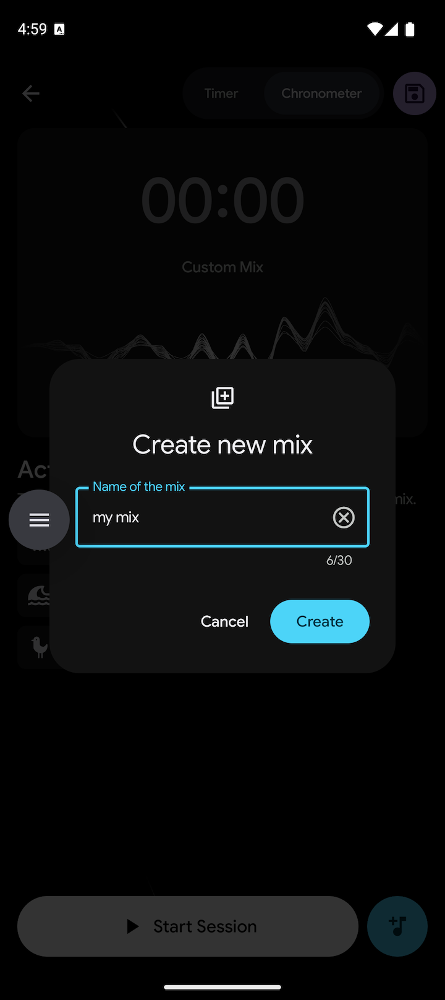 |
| **Timer - No timer set** | **Set time** | **Timer - Session started** | **Manage tracks** |
| 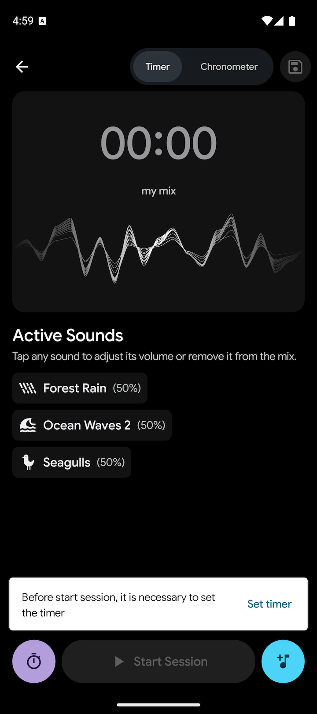 | 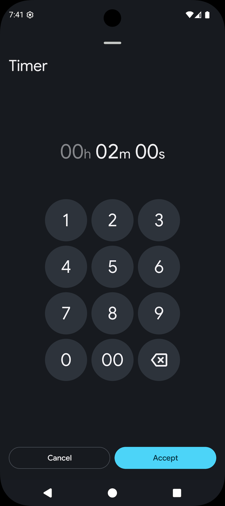 | 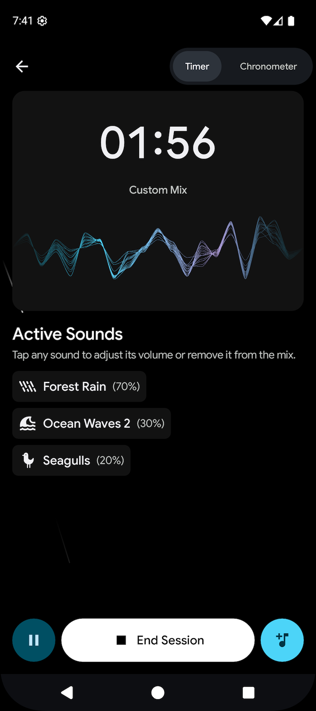 | 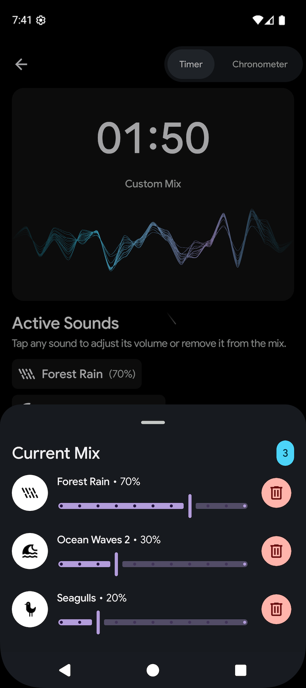 |
| **Notification** | **Session paused** | **My mixes** | **My mix - Options** |
| 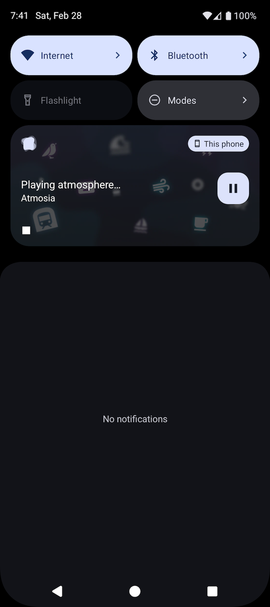 | 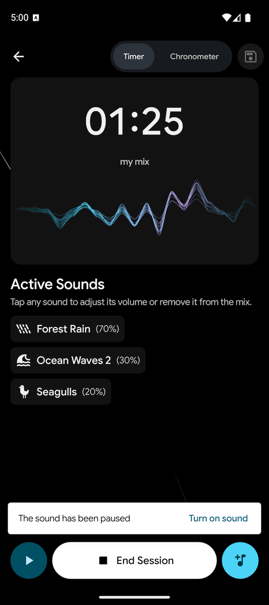 | 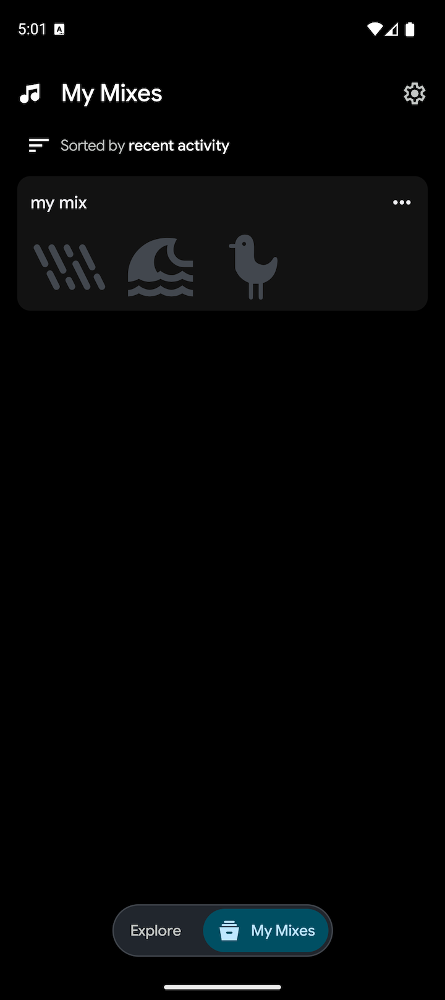 | 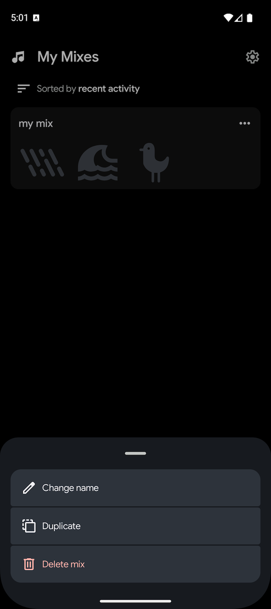 |
| **In-app Update** |  |  |  |
| 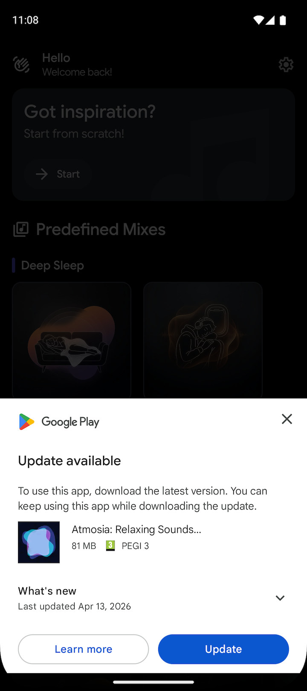 |  |  |  |

## 📞 Contact

**Daniel Frías** - [danielfb2312@gmail.com](mailto:danielfb2312@gmail.com) - [LinkedIn Profile](https://www.linkedin.com/in/daniel-frias-balbuena/)
